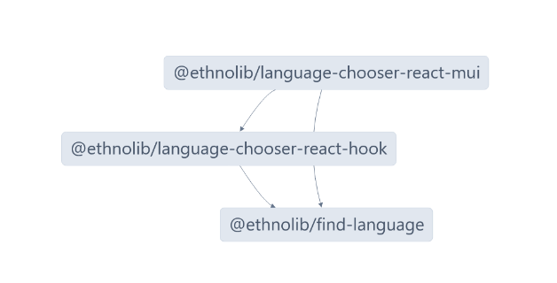
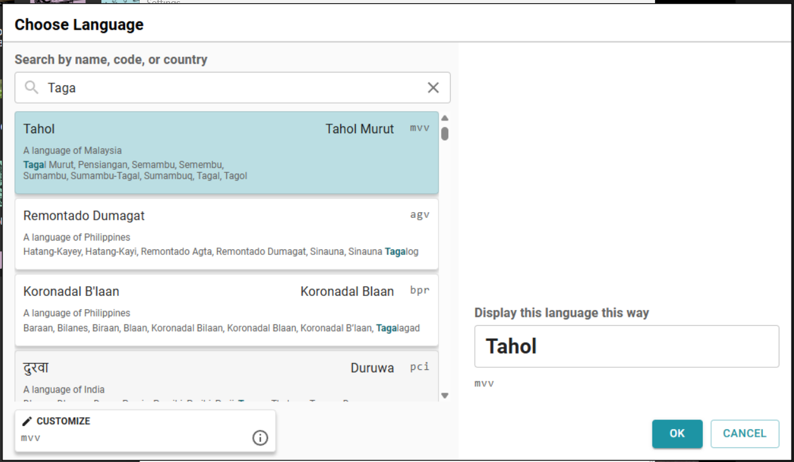

# Ethnolib

Ethnolib is a small collection of browser components for language apps. Each component may be published to its own npm package.

## Components



### [Find-Language](components/language-chooser/common/find-language/README.md)

A package for fuzzy-searching for languages, with language database based on [langtags.json](https://github.com/silnrsi/langtags). It also includes various utilities for working with language tags and language info.

### [Language Chooser React Hook](components/language-chooser/react/common/language-chooser-react-hook/README.md)

A React hook that provides the logic for a language chooser component. It utilizes the `find-language` component.

### [MUI Language Chooser](components/language-chooser/react/language-chooser-react-mui/README.md)

A MUI styled language chooser interface, initially developed for use in [BloomDesktop](https://github.com/BloomBooks/BloomDesktop). It uses the `language-chooser-react-hook` component.



## Development

Ethnolib is a [monorepo using nx](https://nx.dev/concepts/decisions/why-monorepos), with npm for package management.

We recommend installing nx globally.
`npm i -g nx`. If you prefer not to, you can simply prefix all commands with with `npx` instead.

Nx caches builds for efficiency. To clear the local cache, run `nx reset`.

Use nx to build or run a hot-reload development server for a package if relevant. For example, to build or run the MUI language chooser demo:

```
nx build @ethnolib/language-chooser-react-mui
```

or

```
nx dev @ethnolib/language-chooser-react-mui
```

## Testing

Vitest is used for writing unit tests. From the top level folder, all of the unit tests can be run with these commands:

```
npm run test
```

or

```
npm run testonce
```

The first command runs the tests continually in _watch_ mode with minimal output while tests are passing successfully. The second command runs all the tests just once and quits after printing a summary of test results to the console window.

### Dependency Versions

We are currently having all packages manage their own dependencies in their package level `package.json` files, but keeping them all on the same versions of commonly used packages for compatibility. Current versions:

    "react": "^17.0.2",
    "@mui/material": "^5.15.19",
    "@emotion/react": "^11.11.4",

For volta users, we specify the node version in the main package.json, and then all packages should inherit it by adding something like the following to their package.json, with the path relative path to the main package.json. See https://docs.volta.sh/advanced/workspaces

    "volta": {
        "extends": "../../../../package.json"
    }
